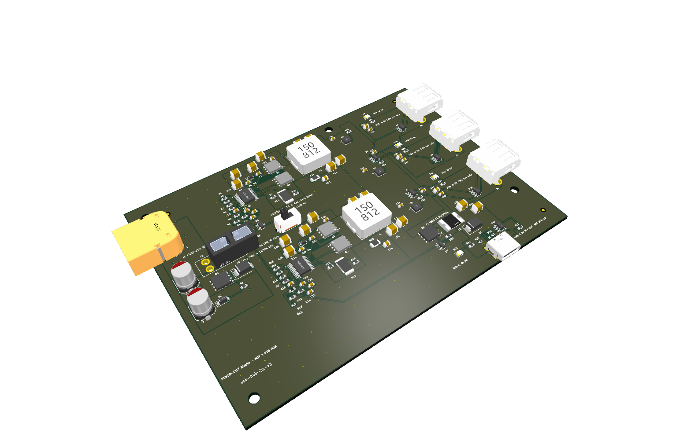
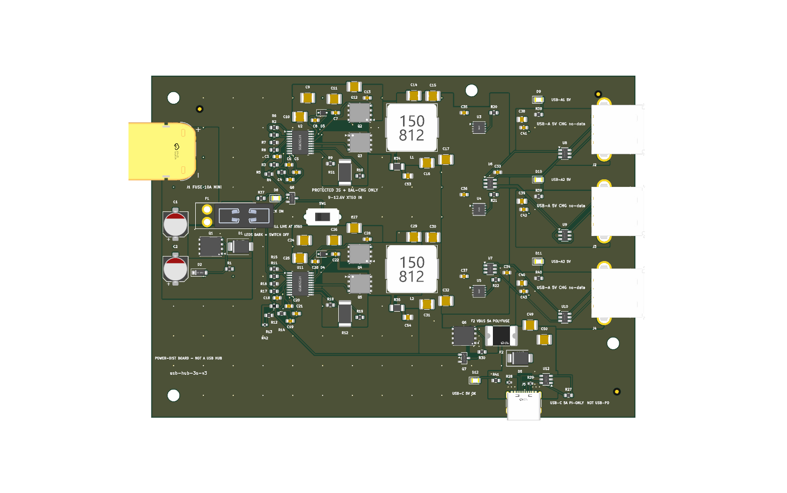

# circuits

## Quick start

### 1. Install the skills

In Codex, invoke the built-in skill installer once:

```text
$skill-installer Install skills/pcb-design, skills/kicad-pcb, skills/jlcpcb-fab, skills/pcb-enclosure, and skills/shopping-list from https://github.com/misko/circuits.
```

The installed skills are available on your next turn. See
[OpenAI's Skills guide](https://learn.chatgpt.com/docs/build-skills) for
discovery and installation details.

### 2. Run the installed PCB skill

Type `/skills`, select `pcb-design`, and paste only the brief:

```text
3S LiPo input → 4× USB-A outputs at 5 V / 1.5 A each + 1× USB-C output at 5 V / 5 A.
```

The equivalent one-line direct invocation is:

```text
$pcb-design 3S LiPo input → 4× USB-A outputs at 5 V / 1.5 A each + 1× USB-C output at 5 V / 5 A.
```

That is the entire prompt: the skill preserves it as the source brief, starts
the governed workflow, and stops when a real decision or evidence checkpoint
needs attention.

### 3. See a fabricated example

The closest existing hardware is [`usb-hub-3s-v3`](projects/usb-hub-3s-v3/):
a 3S-LiPo power board with three USB-A outputs and one USB-C output. It is not
the exact four-USB-A target above, but its latest sealed and fabricated archive,
[`v1.12-2026-07-28`](projects/usb-hub-3s-v3/07_releases/v1.12-2026-07-28/),
shows the kind of reviewed PCB evidence this pipeline produces.

| 3D digital-twin isometric render | 3D digital-twin top render |
|---|---|
| [](projects/usb-hub-3s-v3/07_releases/v1.12-2026-07-28/verification/twin_iso_nw.png) | [](projects/usb-hub-3s-v3/07_releases/v1.12-2026-07-28/verification/twin_top.png) |

The [hardware bring-up journal](projects/usb-hub-3s-v3/01_docs/journal/bringup.md)
records the physical v1.12 boards and the replacement assembly's successful
no-load regulation checks. Full load, transient, and thermal qualification is
still open, so this is a fabricated example rather than a production-qualified
claim.

## What this repository is

`circuits` is a code-first PCB engineering system. It turns a user brief into
generated KiCad source, bounded routing candidates, independently graded
fabrication evidence, immutable releases, printable enclosures, and measured
first-article records.

The product is the workflow under [`skills/`](skills/). Boards under
[`projects/`](projects/) are its active applications; sealed release folders
are immutable evidence, not templates to copy.

## Manual commissioning

Clone the repository, create a branch, and save the user's original request as
a UTF-8 text file:

```bash
git clone https://github.com/misko/circuits.git
cd circuits
git switch -c codex/my-board
```

Create the governed project scaffold and choose its capability profile:

```bash
python3 skills/pcb-design/scripts/commission_project.py my-board \
  --brief-file /path/to/original-brief.txt \
  --signal-integrity ordinary \
  --assembly jlcpcb \
  --firmware forbidden \
  --target design
```

Use `high_speed_digital` for USB and similar controlled digital links. Use
`rf` only when the board intentionally carries RF/microwave signals. Add
`--foreign-mating` when the floorplan consumes geometry from third-party
hardware. Run the command with `--help` for enclosure and target options.
Here `--assembly jlcpcb` selects the populated JLCPCB PCBA evidence path, not
merely bare-board fabrication.

The command reports `PCB-SCAFFOLD OK` and leaves `PCB-COMMISSION` explicitly
`INCOMPLETE`. It preserves the prompt and creates an executable commission
hold; it does not accept requirements, adopt the seeded schema examples, or
run a board producer.

Inspect the selected lifecycle before spending engineering time:

```bash
python3 skills/pcb-design/scripts/skill_reference_router.py \
  --profile projects/my-board/01_docs/capability-profile.json \
  --at-stage PCB-COMMISSION \
  --json
```

Then give Codex this instruction:

```text
Read and follow skills/pcb-design/SKILL.md for projects/my-board. Preserve the
original brief, close the commission fact locks, and stop at the first evidence
or operator checkpoint. Do not create firmware unless the brief explicitly
asks.
```

Do not run `rebuild_all.sh` yet. The scaffold contains visible schema examples
and `01_docs/COMMISSIONING-HOLD.md`; both rebuild conductors refuse to run until
the commission boundary is reviewed and that marker is deliberately removed.

Start with [`skills/pcb-design/SKILL.md`](skills/pcb-design/SKILL.md). Its
canonical lifecycle and runnable command map is
[`execution-graph.md`](skills/pcb-design/references/execution-graph.md).

## How execution is structured

The repository deliberately separates three layers:

```text
capability profile
  -> disclosure graph (what stages/references are selected)
  -> project conductor (what bounded commands actually run)
  -> owning gates (what exact subjects passed)
  -> review/seal/publication/physical claims
```

- The router is planning only. Its output is never execution evidence.
- `projects/<name>/03_src/rebuild_all.sh` is the full source/schematic
  conductor. It intentionally pauses at review and operator checkpoints.
- `rebuild_reuse.sh` is the deterministic route-authority replay when the
  schematic is unchanged; `route.yaml` selects the authenticated source.
- Fresh route exploration is a separate candidate workflow; canonical rebuild
  replays the authenticated route source selected by `route.yaml`.
- Layout seal, PCB release seal, publication, ordering, and first article are
  different claims with different owners.

The declarative lifecycle is:

```text
commission -> architecture -> sourcing
  -> schematic -> placement -> routing -> layout seal
  -> fabrication -> assembly verification
  -> release review -> release seal
  -> publication | first article -> production
```

RF context/source/realized/fabrication stages and foreign-mating import are
conditional branches. High-speed digital composes inside the ordinary stages.
Enclosures have an implemented parallel **INCOMPLETE-candidate** release stream
and may bind an unchanged PCB release without resealing it. Higher readiness
still requires the enclosure skill's recomputable CAD and physical evidence.
Firmware is currently an explicit handoff,
not a governed release stream; [IMP-234](improvements.md#imp-234--firmware-release-stream)
tracks that missing boundary.

## Skills and authority

| Skill | Owns |
|---|---|
| [`pcb-design`](skills/pcb-design/SKILL.md) | Commission, lifecycle composition, backtracking, reviews, release seal, publication, first article. |
| [`kicad-pcb`](skills/kicad-pcb/SKILL.md) | TSX/KiCad schematic conversion, netlist/parity, placement, geometry, routing, DRC, SI/RF realization. |
| [`jlcpcb-fab`](skills/jlcpcb-fab/SKILL.md) | Gerber/drill/BOM/CPL, stock/population/rotation, JLC CAD twin, manufacturer staging, bring-up cards. |
| [`pcb-enclosure`](skills/pcb-enclosure/SKILL.md) | Mechanical commission, PCB interface binding, independent fasteners, motion/clearance, mesh/physical evidence, enclosure releases. |
| [`shopping-list`](skills/shopping-list/SKILL.md) | Provenance-bound purchase lists for self-supplied parts. |

Authority is singular. A skill links to another owner's procedure rather than
copying it. Project `contracts.md` files own exact artifact membership. Script
`--help` text owns exact flags. [`improvements.md`](improvements.md) tracks
work and rationale but never overrides an executable gate or accepted ADR.

## Repository map

| Path | Purpose |
|---|---|
| [`skills/`](skills/) | Reusable workflow, references, tools, and project templates. |
| [`projects/`](projects/) | Active boards, including manufactured and still-evolving designs. |
| [`archived_projects/`](archived_projects/) | Retired scaffolds and frozen regression/history units. |
| [`recovery/`](recovery/) | Read-only migration/recovery snapshots; never current project authority. |
| [`docs/`](docs/) | Documentation index, accepted ADRs, measured proof, and historical context. |
| [`tests/`](tests/) | Clean and known-bad fixtures proving gates can both pass and fail. |
| [`spf/`](spf/) | Measured/cited facts about external hardware this repo must mate with. |
| [`improvements.md`](improvements.md) | Forward work registry and retained improvement history. |

See [`docs/README.md`](docs/README.md) for the documentation authority map.

## Design model

The board is generated from committed human-owned source:

- TSX/tscircuit is the standard schematic authoring front end.
- Shared scripts convert the circuit, generate KiCad geometry/rules, and grade
  exact identities. Per-board source is configuration, not a copied backend.
- KiCad's Python API owns geometry and saves; `kicad-cli` owns headless
  ERC/DRC/netlist/export checks.
- Routing operates on immutable candidates. Only a clean, independently graded
  candidate can become the promoted route chain.
- Generated `04_kicad/` is a mutable current snapshot and is never hand-source
  authority. Immutable history lives under release streams.

This makes design changes diffable and rebuildable. It also means a generator
defect can become a physical defect, so freshness, parity, nonzero coverage,
registered models, and independent review are first-class gates.

## Claims and releases

A release is an immutable reviewed candidate archive. It is not automatically
an order event. A design can be electrically sound and sealed while remaining
`DO-NOT-ORDER` because stock, uploader selections, physical fit, or first-
article evidence is owed.

PCB and enclosure versions are independent streams. Current enclosure release
tooling publishes immutable `INCOMPLETE` candidates bound to one exact PCB
release without forcing that PCB to be resealed; it does not yet publish a
higher readiness claim from caller-supplied scope status.
A future firmware stream and exact product lock remain tracked work, not
current release authority.

## Toolchain

Core documentation and planning use normal Python 3. KiCad operations require
the KiCad-bundled Python where `import pcbnew` succeeds plus `kicad-cli`.
TSX generation requires the pinned tscircuit/Bun environment. Fresh routing
requires the configured KiCadRoutingTools installation; replaying a selected
authenticated route authority does not.

Python entry points expose `--help`; shell-conductor forms are documented in
the execution graph. Use the owning current command rather than copying an old
invocation from a project journal.

## Validate a workflow change

At minimum:

```bash
python3 skills/pcb-design/scripts/skill_authority_check.py
python3 tests/t1_skill_progressive_disclosure.py
python3 tests/t1_pcb_documentation.py
python3 scripts/contracts_audit.py --walk --root skills/pcb-design
```

Run the domain suites affected by the change, then commit at a green boundary.
