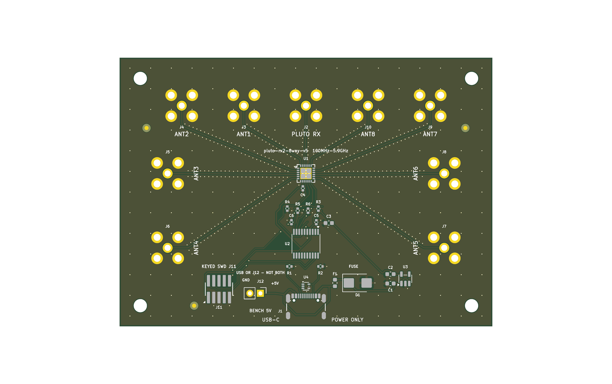

## Executive conclusion

The fabricated v5 PCB is already a disciplined realization of the selected
PE42482 absorptive SP8T: short branch-free top-layer RF paths, a continuous
adjacent ground plane, dense route-following return fences, no RF vias, and a
nine-via grounded exposed pad. **INFERRED:** another small routing cleanup is
unlikely to deliver the largest isolation improvement.

The highest-risk uncontrolled path is outside the switch: direct coupling
between closely spaced antenna elements and their connector/cable fields.
That energy can bypass the SP8T entirely. A bare PETG enclosure is a mechanical
structure, not a specified RF shield, and cannot prevent coupling between
antennas mounted outside it.

The recommended v6 direction is therefore:

1. retain the absorptive PE42482 for the first controlled comparison;
2. move the antennas away from the PCB on short, low-loss shielded coax;
3. terminate those cables at chassis-bonded bulkhead SMAs on a conductive RF
   enclosure, with the Pluto/common connector on the opposite wall;
4. put the switch and RF fanout beneath a grounded shield can in a separate RF
   compartment; and
5. measure the complete matrix before considering a reflective higher-isolation
   switch or a second isolation element on every branch.

**OWED:** no retained VNA matrix exists for the fabricated article, so this
report is a design study, not a measured isolation claim. The existing
first-article target remains at least 25 dB common-to-off isolation at 5.9 GHz.

## Question and scope

This report asks:

- what leakage should be expected from an unselected antenna input into the
  Pluto RX/common port on the fabricated v5 board;
- which paths are intrinsic to the switch and which bypass it;
- what a new PCB revision can change; and
- what enclosure architecture can materially reduce uncontrolled coupling.

The electrical subject is immutable PCB release
[`v0.2.1-2026-08-14`](../../07_releases/v0.2.1-2026-08-14/MANIFEST.txt). The mechanical
baseline is enclosure candidate
[`v0.6.0-2026-08-27`](../../07_enclosure_releases/v0.6.0-2026-08-27/README.md), whose
fit status remains `INCOMPLETE`. This report does not qualify firmware timing,
the extended AD9363 frequency range, antenna radiation patterns, or production
readiness.

## Evidence boundary

| Evidence | Grade | What it establishes | What it does not establish |
|---|---|---|---|
| [PE42482 exact-part dossier](../../02_parts/PE42482A-X/part.yaml) and retained [DOC-75785-4 data sheet](../../02_parts/PE42482A-X/DOC-75785-4.pdf) | **DATASHEET** | Device topology, 50-ohm test conditions and typical/minimum isolation | Fabricated-board or installed-antenna performance |
| [Exact routed RF PCB review](../../07_releases/v0.2.1-2026-08-14/verification/rf_pcb.md) | **MEASURED** on CAD artifact | 0/0/0 DRC/parity, nine branch-free top routes, zero RF vias, 18/18 fence flanks, continuous reference | RF S-parameters |
| [First-article test plan](../../07_releases/v0.2.1-2026-08-14/verification/FIRST_ARTICLE_TEST_PLAN.md) | **CITED** project procedure | Required calibration plane, terminations, state census and acceptance targets | A test result |
| [Fabricated-board photograph](../../../../docs/assets/fab-examples/pluto-rx2-8way-v5-fabricated.jpeg) in the repository showcase | **MEASURED** visual configuration | Direct antenna elements were operated physically close to one another | Coupling magnitude or antenna impedance |
| [Smateway HexRay TX-in-middle study](https://github.com/misko/smateway/tree/codex/stm32-bringup/docs/hexray_tx_in_middle_calibration) | **CITED** cross-project experiment | Excellent fixed-setup 2.4 GHz repeatability, rejected exact-5.8-GHz admission, and a staged leakage-localization hypothesis using the same Pluto/selector system | A locally reopened raw-artifact chain, VNA isolation matrix, or attribution of the unresolved 5.8 GHz leakage path |
| v0.6 PETG enclosure evidence | **MEASURED** mechanical CAD, physical RF **OWED** | Fit, collision and printable geometry under its stated assumptions | Shielding effectiveness or antenna isolation |

The accepted architecture defines a 90 × 65 mm board with five north-edge
ports on 15 mm centres and two ports on each side on 18 mm centres. At
5.9 GHz the free-space wavelength is approximately 50.8 mm. **INFERRED:** those
connector spacings are electrically close enough that antennas mounted directly
to adjacent ports can couple strongly; exact coupling depends on each antenna's
pattern, polarization, impedance, environment and phase.

## Findings

### Device common-to-off leakage matrix

The table below transcribes the PE42482 manufacturer's **typical** RFC-to-off-
port isolation at 4–6 GHz, +25 °C, 3.3 V, with source and load impedances of
50 ohms. Rows are the selected antenna state; columns are the unselected antenna
whose leakage is observed at the Pluto/common port. Higher values are better.
The diagonal is the active signal path, not a leakage result.

| Selected state / isolation (dB) | ANT1 | ANT2 | ANT3 | ANT4 | ANT5 | ANT6 | ANT7 | ANT8 |
|---|---:|---:|---:|---:|---:|---:|---:|---:|
| ANT1 | active | **37** | **35** | 44 | 55 | 50 | 46 | 42 |
| ANT2 | **32** | active | 43 | 49 | 56 | 50 | 46 | 42 |
| ANT3 | **33** | 40 | active | 42 | 56 | 49 | 47 | 42 |
| ANT4 | **33** | **36** | 38 | active | 55 | 49 | 46 | 41 |
| ANT5 | **37** | 45 | 48 | 56 | active | 39 | **36** | **35** |
| ANT6 | **37** | 46 | 49 | 57 | 41 | active | 38 | **35** |
| ANT7 | **37** | 45 | 49 | 57 | 50 | 41 | active | **33** |
| ANT8 | **37** | 46 | 49 | 57 | 46 | **35** | **34** | active |

**DATASHEET:** the ideal-device matrix spans 32–57 dB in this band. The
asymmetry is expected: selecting a different throw changes the internal ON/OFF
network, so reversing row and column is not the same switch state. Bold cells
are below 38 dB and deserve priority in the first VNA run; bold is an analysis
aid, not a new acceptance limit.

**INFERRED:** a reasonable planning range near 5.9 GHz is approximately
25–50 dB at the assembled SMA planes, with the weakest device cells likely in
the 25–35 dB region after mismatch, connectors, board parasitics and unintended
coupling are included. This is deliberately wider and weaker than the data-sheet
matrix. It must not be reported as a measurement.

### Why installed leakage can be worse

| Leakage path | Expected importance | Reason | Design lever |
|---|---|---|---|
| PE42482 internal common-to-off path | High, bounded by device | Off-state capacitance and internal topology produce the 32–57 dB typical matrix at 4–6 GHz | Different switch architecture or a second branch element |
| Antenna-to-antenna radiation | Potentially dominant with direct whips | Energy travels through space and enters another antenna without traversing the PCB switch | Remote/separate antennas, orientation and installation geometry |
| SMA launch and PCB near-field coupling | Secondary but real at the top of band | Connectors and fanout are distributed RF structures; imperfect return currents and finite fence spacing allow coupling | Shield can, chassis bond, shorter fanout, grounded partitions |
| Parallel coax/harness coupling | Configuration-dependent | Closely bundled shields, imperfect connectors and common-mode current create a bypass path | Double-shielded cable, spacing, crossed routes, 360-degree bulkhead bonds |
| Enclosure seam/aperture coupling | High for an unbonded plastic case | PETG is not a continuous conductor; long seams and apertures do not contain fields | Bonded metal RF compartment, conductive gasket, controlled vents |
| Load mismatch and reflection | Several decibels of uncertainty | Real antennas are not ideal 50-ohm loads across the full band | Measure return loss; retain absorptive switch or model reflective alternative |

Analog Devices' arbitrary-load analysis shows why the termination condition
matters: with 10 dB return loss at both relevant ports, isolation uncertainty
can reach about 5 dB in its worked example. The same note reports substantially
greater degradation for a reflective filter-bank switch than an absorptive one
under strongly reactive loads. **CITED:** this supports retaining the absorptive
PE42482 for the first mechanical/antenna comparison rather than changing both
the RF IC and system boundary at once.

### What the current PCB already does well

The sealed review establishes these realized properties:

- **MEASURED:** nine branch-free 0.295 mm F.Cu RF paths over a continuous
  In1.Cu reference plane;
- **MEASURED:** no RF vias or intentional stubs;
- **MEASURED:** 18/18 route-following return-fence flanks pass, with a
  1.3979 mm worst aperture against the 1.4000 mm project ceiling;
- **MEASURED:** the PE42482 exposed pad uses exactly nine selectively filled and
  copper-capped ground vias; and
- **MEASURED:** final board DRC, unconnected and parity results are 0/0/0.

These facts reduce board-created leakage risk. They do not exclude radiation
between connectors or antennas, and they do not override the switch's own
isolation floor.

### Cross-project evidence from the HexRay experiment

The Smateway HexRay TX-in-middle experiment exercises the same Pluto/selector
system in a six-element circular array. **CITED:** its accepted 2.4 GHz v2.2 run
retained 15 unique streams with no retries, passed independent held-out-round
checks and showed very strong fixed-setup repeatability. The uncorrected system
nevertheless reached a 9.68 dB gain span and 41.01° phase RMS, while sparse
leave-one-frequency-out errors reached 3.14 dB and 18.19° RMS. Its coefficients
are therefore correctly limited to the measured frequencies and configuration.

That result supports two findings in this report:

- **INFERRED:** connector, cable, switch, antenna, mutual-coupling and room terms
  can dominate over the realized PCB-length prior even when the PCB routes are
  stable and well controlled; and
- **PROPOSED:** v6 validation must test frequency and physical-configuration
  transportability rather than only reapplying one centered-array correction.

The exact-5.8-GHz extension was correctly rejected because direct/common leakage
masked the ALL_OFF amplitude marker. Removing the separately attached TX2
antenna changed the RX2 peak at the strongest tested condition from an attached
mean of 383 counts to 389 counts, only +1.57%. **CITED:** that controlled change
deprioritizes TX1-to-TX2-antenna reradiation as the dominant RX2 path, but it
does not identify the remaining path. The retained candidates are Pluto-internal
TX1-to-RX2 leakage, RX2 cable/common-route coupling, finite selector/PCB
isolation, and cable or connector faults.

The study's inverse analysis also rejects one static relative path delay for
ANT2 through ANT6, with best-fit residuals of 12.29–18.91° RMS and a shared
2.440 GHz excursion. **CITED:** this is consistent with a frequency-dependent
end-to-end response, not a correction reducible to PCB or cable length alone.
The associated [follow-up analysis issue](https://github.com/misko/smateway/issues/1)
records the proposed boundary-isolation, dense-sweep, conducted-fixture,
transportability and spatial-mode experiments.

**OWED:** the Smateway repository currently retains summary snapshots and
hashes but not a release-local raw evidence package containing the timing pair,
15 accepted SigMF streams and exact-5.8-GHz diagnostic captures. Treat these
findings as cited experimental evidence until that chain can be reopened from a
durable artifact package.

## Recommendations

### Recommended v6A — change the RF system boundary first

| Priority | Proposed change | Likely benefit | Cost/tradeoff |
|---:|---|---|---|
| 1 | Replace direct antenna mounting with short, low-loss, double-shielded coax to a remote antenna panel | Removes the closest external bypass path from the PCB perimeter | Cable loss and a larger mechanical assembly; cable choice matters at 5.9 GHz |
| 2 | Use chassis-mounted SMA bulkheads with full circumferential shield contact; put Pluto/common on the opposite wall | Forces cable shields and connector return current into a defined conductive boundary | New connector/pigtail BOM and assembly operation |
| 3 | Use a bonded aluminum RF enclosure or metal RF cassette inside a printable outer shell | Contains board/connector fields while retaining printable ergonomics | Conductive seams, corrosion compatibility and assembly tolerance must be designed |
| 4 | Add a grounded shield-can footprint over U1 and the central fanout | Reduces near-field bypass around the switch | Adds keepout, soldering and service constraints |
| 5 | Separate RF and MCU/power volumes with a bonded partition; filter controls at the boundary | Keeps digital/common-mode currents out of the RF cavity | Larger enclosure and explicit feedthrough design |
| 6 | Preserve independent PCB and case fasteners | Maintains stable RF grounding and prevents board motion when the lid is removed | Eight fasteners/insert stacks instead of a shared stack |

**PROPOSED:** the most practical enclosure is a hybrid. Keep an FDM-printed
outer structure and antenna strain relief, but place the PCB in a close-fitting
aluminum RF cassette with a conductive lid gasket. Bulkhead SMAs belong to the
metal wall, not unsupported plastic. Use no ventilation opening in the RF bay
unless thermal evidence requires it; if airflow is necessary, use a bonded
waveguide-below-cutoff/honeycomb solution rather than a long open slot.

The metal enclosure cannot stop two external antennas from coupling to each
other. Antenna separation, orientation and cable routing remain separate
system-level controls. At 5.9 GHz, one free-space wavelength is only about
51 mm; use that as an initial experimental spacing step, not as a universal
guarantee, and measure several spacings/orientations.

### v6B — higher-isolation SP8T option

Analog Devices specifies the reflective ADRF5080 at 100 MHz–20 GHz with
typical 1.3 dB insertion loss through 6 GHz, 50 dB RFC-to-RFx isolation and
46 dB RFx-to-RFx isolation through 6 GHz. **INFERRED:** against the weakest
32–37 dB PE42482 cells, that suggests a nominal device-level improvement of
roughly 9–18 dB.

It is not a drop-in improvement. It is reflective rather than absorptive, uses
a 5.5 mm LGA and a different supply/control implementation, costs materially
more, and is more exposed to arbitrary antenna mismatch. **PROPOSED:** evaluate
it only on a controlled coupon or v6B variant after v6A separates antenna and
enclosure effects. Do not infer installed isolation from its headline number.

### v6C — second isolation element per branch

An absorptive series switch on each of the eight antenna branches can place two
OFF barriers in a leakage path. A single extra switch at the common Pluto port
does not provide that benefit while the selected path is ON. **PROPOSED:** keep
per-branch double switching as the high-isolation option if v6A and a candidate
SP8T still miss the system requirement.

The trade is substantial: eight more RF devices, control lines, bias networks,
selected-path insertion loss, layout area and new opportunities for coupling.
Isolation figures must not simply be added in dB unless a prototype shows that
the two stages are sufficiently independent and external bypass paths are below
their combined leakage.

## Validation plan

### Phase 1 — establish the fabricated v5 baseline

1. Calibrate a VNA at the board's SMA mating planes over 100 MHz–6 GHz.
2. Terminate all unused ports in known 50-ohm loads.
3. For every selected state, measure the selected insertion/return loss and all
   seven common-to-off paths: 56 off-path sweeps total.
4. Measure ALL_OFF common-to-each-antenna paths and adjacent/worst antenna-to-
   antenna port pairs.
5. Retain Touchstone data, calibration records, cable identities, switch-state
   evidence and photographs. Apply the existing >=25 dB isolation criterion at
   5.9 GHz; do not infer missing cells.

### Phase 2 — isolate the dominant physical mechanism

Repeat the same matrix with one controlled change at a time:

1. keep the bounded TX1 stimulus, disconnect the selector and terminate Pluto
   RX2 directly at its own reference plane;
2. add only the immobilized RX2 cable with a 50-ohm termination at its far end;
3. add the bare selector with every antenna input terminated in 50 ohms;
4. add the current plastic enclosure;
5. replace it with the bonded metal RF cassette;
6. attach antennas at increasing separation and changed orientation; and
7. test the final cable routing and closed enclosure.

The delta between steps identifies whether the switch, PCB, connector harness,
enclosure or antenna field dominates. A near-field probe scan around the switch,
SMA launches and enclosure seams is useful diagnostic evidence, but the calibrated
S-parameter matrix remains the acceptance authority.

### Phase 3 — map frequency dependence and transportability

1. Without moving the assembly, acquire a dense immutable 2.400–2.483 GHz
   sweep at approximately 1–2 MHz spacing.
2. Fit an unwrapped affine phase/group-delay model per antenna and retain the
   residual versus frequency as the dispersive/coupling fingerprint.
3. Repeat with a conducted through-path fixture and a predeclared cable/antenna
   permutation to separate PCB/switch, cable/connector and OTA terms.
4. Re-run after controlled source-position, source-height, antenna-polarization,
   cable-routing, enclosure and day changes. Report when a fresh calibration is
   required rather than assuming coefficient transportability.
5. Retain C6 spatial-mode power, physical opposite-pair residuals and equal-PCB-
   length-pair residuals across the sweep.

### Phase 4 — compare v6 options

Build otherwise-comparable coupons for PE42482 and any alternative SP8T. Use the
same launches, stackup, connector planes and loads. If per-branch double switching
is considered, measure both intended series leakage and external bypass coupling.
Freeze a v6 architecture only after the application supplies a required system
isolation floor and the selected configuration meets it across frequency,
temperature-relevant conditions and expected antenna return loss.

## Source register

| Source | Type | Use in this report |
|---|---|---|
| [pSemi PE42482 data sheet, DOC-75785-4, Rev. 09/2023](https://www.psemi.com/pdf/datasheets/pe42482ds.pdf) and [retained exact bytes](../../02_parts/PE42482A-X/DOC-75785-4.pdf) | Exact-part primary source | 4–6 GHz isolation matrix, test conditions, absorptive architecture |
| [Project architecture](../ARCHITECTURE.md) | Mutable project authority | System boundary, stackup, connector spacing, existing first-article targets |
| [Sealed RF PCB review](../../07_releases/v0.2.1-2026-08-14/verification/rf_pcb.md) | Immutable release evidence | Realized RF routing, return fencing, exposed-pad grounding and DRC state |
| [Sealed first-article test plan](../../07_releases/v0.2.1-2026-08-14/verification/FIRST_ARTICLE_TEST_PLAN.md) | Immutable release procedure | VNA plane, termination/state census and acceptance method |
| [ADI AN-2558 — RF Switch Performance with Arbitrary Loads](https://www.analog.com/en/resources/app-notes/an-2558.html) | Manufacturer application note | Return-loss and reflective/absorptive isolation uncertainty |
| [ADI ADRF5080 data sheet](https://www.analog.com/media/en/technical-documentation/data-sheets/adrf5080.pdf) | Alternative exact-part primary source | Candidate insertion loss, isolation, topology, package and supply comparison |
| [TE Connectivity EMI shielding resources](https://www.te.com/en/products/emi-and-emc-solutions/emi-shielding/resources/knowledge-hub.html) and [EMI vent guidance](https://www.te.com/en/products/emi-and-emc-solutions/emi-shielding/emi-vents.html) | Manufacturer mechanical guidance | Conductive seams/gaskets and waveguide-below-cutoff ventilation approach |
| [Enclosure v0.6.0 README](../../07_enclosure_releases/v0.6.0-2026-08-27/README.md) | Immutable mechanical candidate evidence | Current fit architecture and explicit physical/RF evidence boundary |
| [Smateway HexRay TX-in-middle calibration study](https://github.com/misko/smateway/tree/codex/stm32-bringup/docs/hexray_tx_in_middle_calibration) | Cross-project experimental report | Accepted fixed-setup 2.4 GHz calibration, rejected 5.8 GHz extension, frequency-dependent path finding and staged leakage discriminator |
| [Smateway issue #1 — follow-up analysis ideas](https://github.com/misko/smateway/issues/1) | Public follow-up record | Boundary isolation, conducted leakage matrix, dense sweep, controlled permutation, transportability and evidence-package work |

## Disposition

Report synthesis: **REVIEWED**. Product evidence: **INCOMPLETE**.

No PCB or enclosure source is changed by this report. If the v6A direction is
accepted, create an ADR that locks the conductive RF boundary, connector/cable
topology and measurement requirement before schematic or enclosure CAD work.
