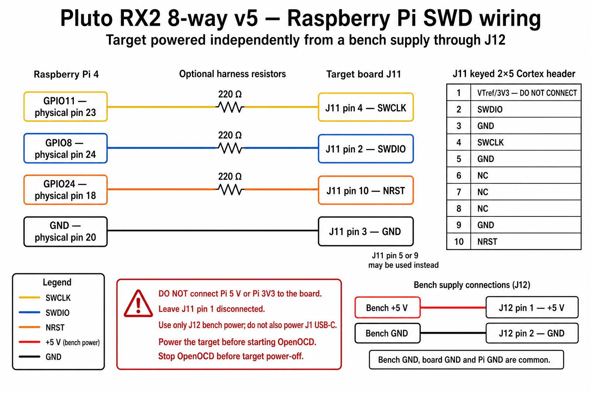

# Firmware and field programming

## First-article execution update — 2026-08-25

The staged first-article procedure below has now been executed for article
`stm32c011-4c0055000950313950363920`. Read-only SWD identification, two matching
factory-flash reads, safe-hold programming, static-selector control and recovery,
and autonomous Fast20 programming/readback/recovery all passed. The deployed
Fast20 source is commit `5238fbd` on `codex/stm32-bringup` in `~/smateway`;
the phase analyzer is commit `cd67b86` on the same branch; reusable Pluto
capture support is commit `f495a1c` on `codex/safe-tone-stimulus` in
`~/pluto-plus-utils`.

After an accidental J12 power disconnect, the powered run was repeated. Both
10-second captures contain 100 consecutive 100,000-sample frames and exactly
10,000,000 FPGA-counted samples, with no missing samples or overflow/failure
flags. TX1 produced its strongest coupling through ANT4 and TX2 through ANT5;
the `ALL_OFF` residuals were respectively 72.5 dB and 66.7 dB below those
strongest states. This verifies selector operation and a stable relative phase
fingerprint. It is not calibrated insertion-loss, isolation or emitter-position
evidence.

The article-specific evidence is retained outside Git at
`~/.local/state/smateway/boards/stm32c011-4c0055000950313950363920/`.
The powered phase audit is
`fast20-5238fbd/powered-phase-capture-2026-08-25.md`. The earlier continuous
captures `e0ec4d...` and `a02d1503...` are explicitly superseded because the RF
board was unpowered during them. Post-capture readback confirmed both Pluto TX
gains at -80 dB, all DDS scales at zero and cyclic buffering disabled.

Raw phase includes unequal PCB traces, switch paths, antennas, mutual coupling
and receiver paths. Trustworthy geometric localization therefore requires
complex per-path and in-situ antenna calibration, preferably at multiple
frequencies. Confidence from the present analyzer describes schedule alignment
and repeatability, not the probability of a physical emitter position.

## RPi4 first-article programming plan

Status at handoff, 2026-08-24:

- first-article hardware has powered successfully and J11.1 measures 3.3 V;
- the Raspberry Pi 4 SWD harness is connected to J11 and the target is powered
  independently from a bench supply through J12;
- three SMA connectors have been hand-fitted, but no complete electrical or RF
  acceptance run has been recorded;
- this directory contains the generated control profile, but no target source,
  linker script, Makefile or qualified firmware image yet; and
- no successful SWD read, factory-flash backup or firmware write has yet been
  recorded.

The objective is deliberately staged: prove read-only SWD access, preserve the
factory flash contents, build and verify an `ALL_OFF`-only recovery image, add a
debug-controlled static selector for bench RF work, and only then implement the
autonomous dwell profile. Each gate must pass before the next gate writes or
changes more state.

### Programming and qualification connections



The initial direct-coax qualification cabling was:

| Connection | Bench routing |
|---|---|
| RF board `PLUTO RX`/common port | Pluto SDR `RX2` |
| Pluto SDR `RX1` | 50-ohm termination |
| Pluto SDR `TX1` | RF board `ANT4` |
| Pluto SDR `TX2` | RF board `ANT5` |

The later powered OTA phase run replaced those two direct coax links with one
antenna on each board ANT1--ANT8 port and one antenna on each Pluto TX output.
The board common remained on Pluto RX2, Pluto RX1 remained terminated, the
inline attenuator was disconnected, and only one TX was stimulated at a time.

These tables record physical setups; they are not calibrated RF acceptance
evidence. Keep `TX1` and `TX2` disabled outside a bounded test. Before any new
direct connection, measure every fitted SMA centre at 0 VDC and verify the
maximum RF level at the board mating plane remains below 0 dBm.

### Non-negotiable electrical rules

- Power the target through exactly one of J1 USB-C or J12 bench 5 V. The Pi must
  never power the target through J11.1, a GPIO, Pi 3V3 or Pi 5V.
- Join Pi and target ground before joining signal wires. J11.1 may be measured
  as target VTref, but a direct Pi GPIO adapter does not need it connected.
- Start OpenOCD only while the target is powered and J11.1 is near 3.3 V. Stop
  OpenOCD before removing target power, preventing GPIO back-power through the
  STM32 protection structures.
- Keep the SWD harness short. Direct connection is permitted because both sides
  use 3.3-V logic; 100--330-ohm series resistors in SWCLK, SWDIO and NRST are
  recommended for the first-article flying-wire harness.
- Do not connect an RF source, receiver or antenna until every fitted SMA centre
  has been measured at 0 VDC. The board contains no RF DC blocks. Keep applied
  RF below the board's 0-dBm operating limit.
- Do not write option bytes, enable readout protection, disable SWD, or enable a
  watchdog until ordinary read/program/verify/reset and connect-under-reset
  recovery have all been demonstrated.

The authoritative J11 and Pi pin mapping remains in
[`../01_docs/ARCHITECTURE.md`](../01_docs/ARCHITECTURE.md). The wiring table
later in this file is its bench shorthand, not a second interface authority.

### Gate 0 — inventory the Pi without touching the target

Assume Raspberry Pi OS Bookworm/Debian unless the captured output proves
otherwise. Record:

```sh
cat /etc/os-release
uname -a
getconf LONG_BIT
ls -l /dev/gpiomem /dev/gpiochip* 2>&1
openocd --version 2>&1 || true
arm-none-eabi-gcc --version 2>&1 || true
```

If the tools are absent, install the distribution packages first:

```sh
sudo apt update
sudo apt install openocd gcc-arm-none-eabi binutils-arm-none-eabi make gdb-multiarch
```

Then require all of the following before wiring the target:

```sh
test -r /usr/share/openocd/scripts/interface/raspberrypi-native.cfg
test -r /usr/share/openocd/scripts/interface/raspberrypi-gpio-connector.cfg
test -r /usr/share/openocd/scripts/target/stm32c0x.cfg
openocd -c "adapter list; shutdown" 2>&1 | grep bcm2835gpio
```

The upstream OpenOCD `raspberrypi-native.cfg` supports Raspberry Pi models
through Pi 4 and uses `/dev/gpiomem` when available. Its connector file maps
GPIO11/physical 23 to SWCLK and GPIO8/physical 24 to SWDIO. Run unprivileged
when `/dev/gpiomem` permissions allow it; do not switch to `/dev/mem` merely to
bypass a fixable group or permissions problem.

Primary references:

- <https://github.com/openocd-org/openocd/blob/master/tcl/interface/raspberrypi-native.cfg>
- <https://github.com/openocd-org/openocd/blob/master/tcl/interface/raspberrypi-gpio-connector.cfg>
- <https://github.com/openocd-org/openocd/blob/master/tcl/target/stm32c0x.cfg>

If the packaged OpenOCD lacks either `bcm2835gpio` or `stm32c0x.cfg`, stop and
record the exact package/version result. Build a pinned upstream OpenOCD only as
a reviewed follow-up; do not silently mix an unknown executable with copied
current scripts.

### Gate 1 — assemble and continuity-check the SWD harness

Use a keyed 10-pin Cortex cable plus a Pi GPIO breakout; the Cortex cable does
not plug directly onto the Pi's 40-pin header. With both systems unpowered,
continuity-check every end-to-end connection and every adjacent pair. Ensure Pi
3V3 and 5V are absent from the harness.

Connect GND, SWCLK, SWDIO and NRST as tabulated below. A first read-only attempt
may use only GND/SWCLK/SWDIO, but NRST should be present before the first flash
so connect-under-reset recovery can be proven.

Power the target independently and remeasure J11.1. Stop for a rail outside the
documented approximately 3.26--3.34-V acceptance interval, unexpected current,
heating, or any wiring uncertainty.

### Gate 2 — add a project-local OpenOCD configuration

The stock Pi connector file maps SWCLK and SWDIO but leaves GPIO24/NRST
commented out. Before relying on reset, add the following reviewed file at
`target/openocd/rpi4-swd.cfg`:

```tcl
source [find interface/raspberrypi-native.cfg]

# Pi GPIO24 / physical pin 18 -> target J11.10 / NRST.
adapter gpio srst -chip 0 24 -active-low

source [find target/stm32c0x.cfg]

# Conservative for a short, resistor-protected first-article harness.
adapter speed 100
reset_config srst_only srst_nogate srst_open_drain
```

Keep a distinct recovery configuration or command-line override using
`connect_assert_srst`; do not make recovery-only reset assertion the unexplained
default. The upstream STM32C0 target defaults to 2 MHz, so the final 100-kHz
override must occur after sourcing it. Raise the speed only after repeated
read/program/verify cycles are clean.

### Gate 3 — prove read-only debug access

From this directory, with the target independently powered:

```sh
openocd \
  -f target/openocd/rpi4-swd.cfg \
  -c "init; reset halt; flash probe 0; flash info 0; flash erase_check 0; shutdown"
```

Acceptance requires a recognized Cortex-M0+ debug port, STM32C0 flash bank,
successful halt and no transport errors. Preserve the complete console output.
Do not proceed merely because OpenOCD starts its TCP ports.

Before the first write, dump all 16 KiB of factory flash to the board's bench
record and hash it. Keep physical article records outside generated firmware
outputs unless a later contract explicitly defines their repository location.

```sh
openocd \
  -f target/openocd/rpi4-swd.cfg \
  -c "init; reset halt; dump_image stm32c011-factory.bin 0x08000000 0x4000; shutdown"
sha256sum stm32c011-factory.bin
```

Also record whether the image is uniformly erased. A non-erased image is not
permission to overwrite unknown vendor or assembly-house content.

### Gate 4 — establish the reproducible firmware build

Create target firmware under `target/`, pure host-testable control logic under
`target/core/` or equivalent, and host tests under `tests/`. The build must:

- expose the exact MCU as a variable whose default matches
  `STM32C011F4P6`, rather than burying a part swap in source edits;
- use `-mcpu=cortex-m0plus -mthumb` and define the official STM32C011 device
  symbol expected by the selected CMSIS release;
- declare 16 KiB flash at `0x08000000` and 6 KiB SRAM at `0x20000000` in the
  reviewed linker script;
- pin and record official ST CMSIS Core/Device inputs, their commit/version and
  licenses. Start from ST's STM32C0 CMSIS component rather than hand-copying
  register addresses: <https://github.com/STMicroelectronics/cmsis-device-c0>;
- emit ELF, BIN, map file, size report and SHA-256; use section garbage
  collection and fail if the image exceeds either device region;
- build without network access after dependencies are fetched; and
- keep PA13/SWDIO and PA14/SWCLK untouched in every firmware mode.

Run host tests before compiling the target. The tests must exhaustively grade
the legal truth table, rejection of every illegal four-bit word, reset to
`ALL_OFF`, and break-before-make transition ordering.

### Gate 5 — first writable image: `pluto_safe_hold`

The first image must do nothing except safely establish and retain `ALL_OFF`:

1. reset with PA0--PA3 still inputs so the external pulls own the switch;
2. enable the GPIOA peripheral clock;
3. atomically preload PA3..PA0 to `1000` while the pins are still inputs;
4. change only PA0--PA3 to push-pull outputs;
5. confirm/read back `1000`; and
6. remain in `ALL_OFF` indefinitely without changing option bytes or enabling
   the watchdog.

The preload must use one atomic set/reset operation, not four visible pin
updates. The image must not configure unrelated GPIOs, clocks or peripherals.

Flash only the reviewed ELF and require verification:

```sh
openocd \
  -f target/openocd/rpi4-swd.cfg \
  -c "program build/pluto_safe_hold.elf verify reset exit"
```

Afterward, power-cycle the target, reconnect over SWD, re-read the flashed
region and compare it to the ELF, record board current and 3V3, and verify the
physical control word `V4..V1 = 1000` with a DMM or logic analyzer. Reprove
connect-under-reset before advancing. Any inability to reconnect is a stop,
not a reason to experiment with option bytes.

### Gate 6 — debug-controlled static bench selector

Build a separate `pluto_bench` image for RF measurements. Do not use the short
autonomous dwells for an initial SDR or VNA test. The bench image should:

- boot and fail safe to `ALL_OFF`;
- expose a volatile RAM command word that OpenOCD/GDB can read and write;
- accept only `ALL_OFF` and the eight generated legal antenna states;
- replace every invalid or stale command with `ALL_OFF`;
- transition through `ALL_OFF` for at least 5 ms before selecting a new path;
- provide a bounded lease/watchdog so debugger loss returns to `ALL_OFF`; and
- preserve SWD pins and connect-under-reset recovery.

Derive states from the generated profile, not a second hand-copied switch
table. Generate a symbol/address manifest so a host command never embeds an
unreviewed RAM address. Add host-side commands for `status`, `all-off`,
`select ANTn` and lease refresh; log each command and observed state.

For the first SDR experiment, use one known fitted common-to-antenna path, a
low-level known tone and fixed attenuation. Record SDR model, firmware, sample
rate, centre frequency, gain, RF source level and cable/attenuator arrangement.
Compare selected, wrong-selected and `ALL_OFF` captures. This is a functional
smoke test, not calibrated insertion-loss, isolation or return-loss evidence.

### Gate 7 — autonomous `fast20-v1` firmware

Only after static selection and reset recovery pass should the target consume
the generated profile below. Implement the documented startup ordering,
hardware timer, atomic four-bit state writes, 5-ms guards, 80-ms marker body and
eight generated dwells. Add BOR level 4 and IWDG in a distinct reviewed step so
their effects on debugging and option bytes are visible.

Qualification must use a logic analyzer on all four switch controls and cover:

- power-on and external reset never emitting an illegal word;
- every selected state preceded by at least 5 ms of `ALL_OFF`;
- ordered 20/23/26/30/34/39/44/50-ms dwells within the generated limits;
- the nominal 85-ms observable marker and 386-ms cycle;
- forced reset and watchdog recovery returning to `ALL_OFF`; and
- an 850-ms RF capture decoding a complete valid frame while absent,
  ambiguous, truncated and reordered observations decode to `unknown`.

### Stop conditions and handoff evidence

Stop immediately for unstable 3V3, unexplained current or heat, RF-port DC,
Pi power reaching J11.1, adjacent-header shorts, inconsistent SWD reads,
verification mismatch, an illegal control word, loss of reset recovery, or any
request to change protection option bytes before the recovery gate passes.

The Pi-side Codex session should begin by reading this file plus:

- [`../01_docs/ARCHITECTURE.md`](../01_docs/ARCHITECTURE.md);
- [`../03_src/rules/control_protocol.yaml`](../03_src/rules/control_protocol.yaml);
- [`../07_releases/v0.2.1-2026-08-14/verification/FIRST_ARTICLE_TEST_PLAN.md`](../07_releases/v0.2.1-2026-08-14/verification/FIRST_ARTICLE_TEST_PLAN.md);
- [`../02_parts/STM32C011F4P6/part.yaml`](../02_parts/STM32C011F4P6/part.yaml); and
- [`../02_parts/PE42482A-X/part.yaml`](../02_parts/PE42482A-X/part.yaml).

For every completed gate, retain the exact command, stdout/stderr, tool
versions, target serial/board identity, artifact hashes and measured electrical
results. Do not describe the board as programmed, autonomous or RF-qualified
until the corresponding gate has objective evidence.

The control timing source of truth is
`../03_src/rules/control_protocol.yaml`.  Do not hand-copy dwell values into
firmware or host analysis.  Regenerate both consumers from the project root:

```sh
python3 ../../skills/kicad-pcb/scripts/control_profile_codegen.py . --write
python3 ../../skills/kicad-pcb/scripts/control_profile_codegen.py . --check
```

The generated outputs are:

- `include/control_profile.h` for the STM32 firmware;
- `host/control_profile.json` for capture/decoder software.

The initial profile is `fast20-v1`, revision 1.  Its eight nominal antenna
dwells are 20, 23, 26, 30, 34, 39, 44 and 50 ms.  They are deliberately
different: the downstream decoder identifies the selected antenna by measured
dwell duration.  A requested change therefore means a new synchronized profile
revision, not a runtime command sent to the board.

## Direct Raspberry Pi SWD programming through J11

No programmer IC is required on the PCB. A Raspberry Pi can drive the STM32
SWD signals directly through OpenOCD using a keyed 10-pin Cortex cable plus a
small Pi GPIO breakout/adapter harness. The Cortex cable does not plug directly
onto the Pi's 40-pin header because the two connector pinouts differ. Power the
target normally through its USB-C connector; the Pi supplies logic signals and
a common ground only.

| Raspberry Pi | Physical pin | J11 pin | Signal |
|---|---:|---|---|
| GPIO11 | 23 | 4 | SWCLK |
| GPIO8 | 24 | 2 | SWDIO |
| GPIO24 | 18 | 10 | NRST (recommended) |
| GND | 20 | 3, 5 or 9 | GND |
| no Pi power connection | — | 1 | Target-powered VTref/3V3 sense only |

Do **not** connect Raspberry Pi 5 V or Pi 3V3 to J11 pin 1. Pin 1 is a
target-powered VTref/test point, not a supply input. A conventional debug probe
uses it to sense I/O voltage; a direct Pi harness may leave it open after
independently verifying that the USB-C-powered target rail is 3.3 V. J11 pins
6, 7 and 8 remain unconnected on this SWD-only target.

For Raspberry Pi 1–4, a typical OpenOCD invocation is:

```sh
sudo openocd \
  -f interface/raspberrypi-native.cfg \
  -f target/stm32c0x.cfg \
  -c "program firmware.elf verify reset exit"
```

For Raspberry Pi 5, use `interface/raspberrypi5-gpiod.cfg`.  Exact GPIO-chip
numbering and permissions remain host-image dependent and must be verified on
the programming Pi. An external ST-LINK remains the recovery and production
fixture fallback through the same standard J11 interface.

There is intentionally no runtime control protocol in v5.  Timing changes are
made by generating a new profile revision, rebuilding the firmware and decoder,
then reflashing over SWD.
